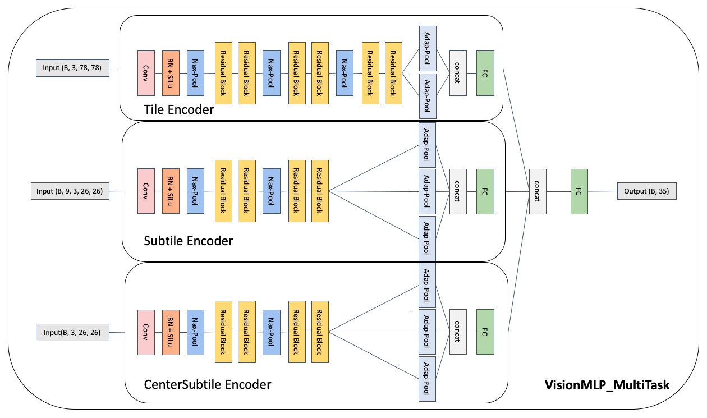
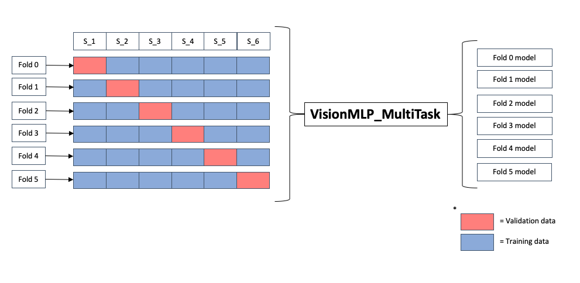
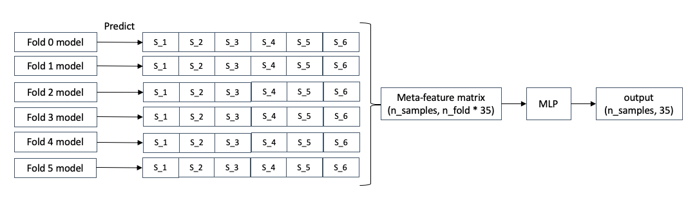

# Spatial Gene Expression Prediction from H\&E Histology

This repository contains code and models for predicting spatial gene expression from H\&E histology images. I combined insights from key research, performed robust preprocessing, and trained multi-scale deep learning models with stacking for optimal accuracy.

> 📅 Dataset available here: [Kaggle Competition - EL Hackathon 2025](https://www.kaggle.com/competitions/el-hackathon-2025/data?select=elucidata_ai_challenge_data.h5)

---

## 1. Search Studies

I reviewed the following papers to build background and inspire architectural decisions:

* **[Benchmarking the translational potential of spatial gene expression prediction from histology](https://www.nature.com/articles/s41467-025-56618-y)**

  This paper reviews multiple models and preprocessing approaches for gene expression prediction. It helped me understand the common practices in stain normalization, spot realignment, and also the prevailing network structures.

* **[DeepSpot: Leveraging Spatial Context for Enhanced Spatial Transcriptomics Prediction from H\&E Images](https://www.medrxiv.org/content/10.1101/2025.02.09.25321567v1)**

  DeepSpot introduced the critical concept of combining local and global structural context. This directly motivated my use of multi-scale input branches in the model.

---

## 2. Exploratory Data Analysis (EDA)

* [https://www.kaggle.com/code/tarundirector/histology-eda-spotnet-visual-spatial-dl](https://www.kaggle.com/code/tarundirector/histology-eda-spotnet-visual-spatial-dl)
  I leveraged the identification of low-activity spatial spots to inform spot realignment.

* [https://www.kaggle.com/code/dalloliogm/eda-exploring-cell-type-abundance](https://www.kaggle.com/code/dalloliogm/eda-exploring-cell-type-abundance)
  This notebook introduced the idea of smoothing rank values using neighboring spots. Though this approach wasn't successful in my case, it provided useful experimentation.

---

## 3. Data Preprocessing

### 3.1 Image Data

* **Stain normalization** - Normalize histological color variation between images.
* **Background masking** - Remove non-tissue regions to focus the model on relevant areas.

### 3.2 Spot Data

* **Spot realignment** - Adjust spot positions to align with image coordinates.
* **Remove invalid data** - Remove spots that fall outside of tissue regions, identified using a grayscale threshold-based tissue mask.
* **Expression ranking** - Replace raw expression counts with rank values for each spot.

### 3.3 Final Preprocessing

* **Calculate spot distance** - Compute average distances between spots.
* **Image tiling** - Extract tiles around each spot for model input.

---

## 4. Model Training

### Model: `VisionMLP_MultiTask`

This multi-branch model integrates both global and local features:

* **Tile Encoder**: Deep encoder with residual blocks and multi-scale pooling.
* **Subtile Encoder**: Uses several subtile patches and aggregates via mean pooling.
* **Center Subtile Encoder**: Focuses on the central subtile using the same structure.



Each branch outputs features, which are concatenated and passed through a decoder MLP for expression prediction.



### Meta-Model: `StackingMLP`

After training 6 individual models using Leave-One-Out Cross-Validation on the 6 training images (S\_1 to S\_6), I ensemble the predictions using a meta model:

* **Input**: Concatenated predictions from base models
* **Model**: MLP with BatchNorm, Dropout, and LeakyReLU
* **Output**: Final expression value predictions



---

## 5. Docker Support with JupyterLab

I provide both CPU versions of the Docker image. Each image includes all dependencies and automatically launches JupyterLab. The Docker image is used for the preprocessing steps. If you want to use GPU to train the model, you need to download the package locally!

### 📅 Pull Image (CPU version)

```bash
docker pull deweywang/spatialhackathon:latest
```

### Run with Jupyter Notebook (Linux/macOS)

```bash
docker run -it --rm -p 8888:8888 -v "$PWD":/workspace \
  deweywang/spatialhackathon:latest \
  jupyter lab --ip=0.0.0.0 --port=8888 --no-browser --allow-root
```

### Run with Jupyter Notebook (Windows CMD)

```cmd
docker run -it --rm -p 8888:8888 -v %cd%:/workspace \
  deweywang/spatialhackathon:latest \
  jupyter lab --ip=0.0.0.0 --port=8888 --no-browser --allow-root
```

> Jupyter will launch with **no token** and **open to all local users** for convenience in local setups.
>
> Navigate to [http://localhost:8888](http://localhost:8888) in your browser.

### ⚠ Common Issues

* **Port already in use**: Change `-p 8888:8888` to `-p 8889:8888` and open [http://localhost:8889](http://localhost:8889)
* **Volume mounting fails on Windows**: Use `-v %cd%:/workspace` in CMD, or `$PWD` in bash.

---

## 💻 Run Locally with GPU/MPS Support

> ✅ All installations are isolated within the `.venv` virtual environment and will **not affect your global Python environment** or system-wide packages.

### Step-by-Step Local Setup (macOS/Linux/Windows)

```bash
make init                  # Step 1. Set up virtual environment and install dependencies
source .venv/bin/activate  # Step 2 (macOS/Linux)
# .venv\Scripts\activate   # Step 2 (Windows)
make lab                   # Step 3. Launch JupyterLab
```

### Inside JupyterLab

* Click the **kernel selector** at the top-right of the notebook interface
* Choose: `Python (.venv) spatialhackathon`

### Extra Commands

```bash
make clean     # Remove the virtual environment and Jupyter kernel spec
make reset     # Clean everything and reinitialize from scratch
```

---

> Tested on: **Apple M1 Pro, macOS Sequoia 15.3.1 (24D70)**

Feel free to open issues!

---

## 📄 License & Credits

This project is released for **research and educational purposes only**.

* The **original dataset** is provided by the [EL Hackathon 2025](https://www.kaggle.com/competitions/el-hackathon-2025) and subject to its own license terms and usage restrictions.
* The **code and models** in this repository are developed by [Ding Yang Wang](https://github.com/Dewey-Wang) and shared under the **Creative Commons Attribution-NonCommercial 4.0 International (CC BY-NC 4.0)** license.
* Key architectural inspirations are derived from published academic work cited above. Please acknowledge the original authors when appropriate.

For full terms, see: [https://creativecommons.org/licenses/by-nc/4.0/](https://creativecommons.org/licenses/by-nc/4.0/)

---

# Citation & Contribution

If you find this project helpful in your research or work, please consider citing it:

### 📖 Citation

```bibtex
@misc{wang2025hevisum,
  author       = {Ding Yang Wang},
  title        = {HEVisum: Spatial Gene Expression Prediction from H\&E Histology},
  year         = {2025},
  publisher    = {GitHub},
  journal      = {GitHub repository},
  howpublished = {\url{https://github.com/Dewey-Wang/HEVisum}}
}
```

or simply use this format:

> Wang, D. Y. (2025). HEVisum: Spatial Gene Expression Prediction from H\&E Histology. GitHub repository: [https://github.com/Dewey-Wang/HEVisum](https://github.com/Dewey-Wang/HEVisum)

### 👍 Contribution

While this project was completed entirely by myself, I welcome feedback or discussions.

If you'd like to adapt this work:

1. Fork the repository
2. Create your feature branch (`git checkout -b feature/AmazingFeature`)
3. Commit your changes (`git commit -m 'Add some AmazingFeature'`)
4. Push to the branch (`git push origin feature/AmazingFeature`)
5. Open a pull request
